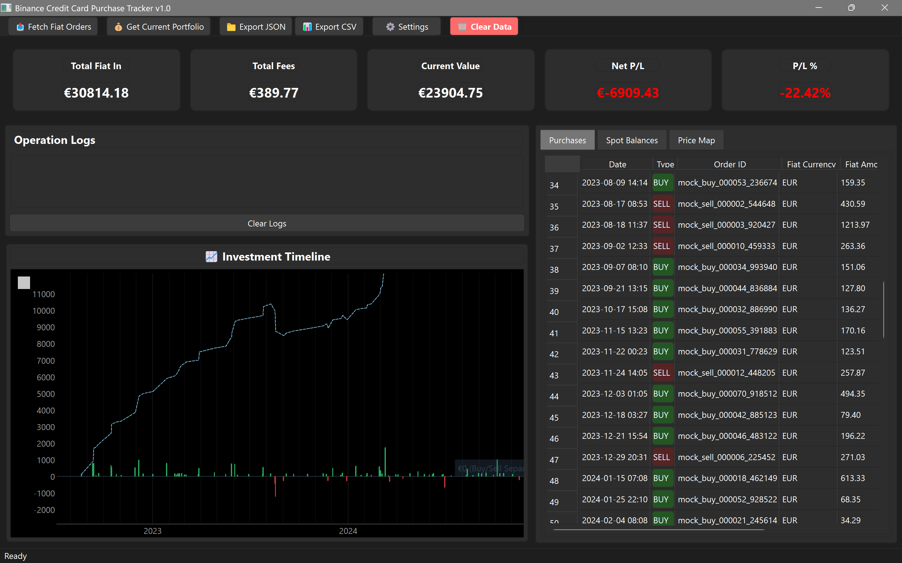
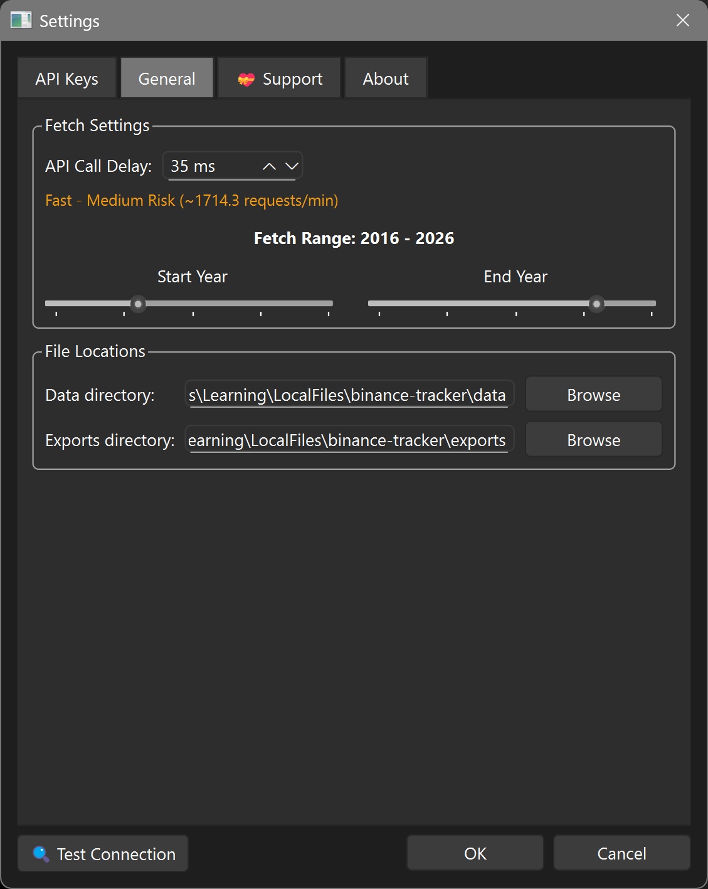
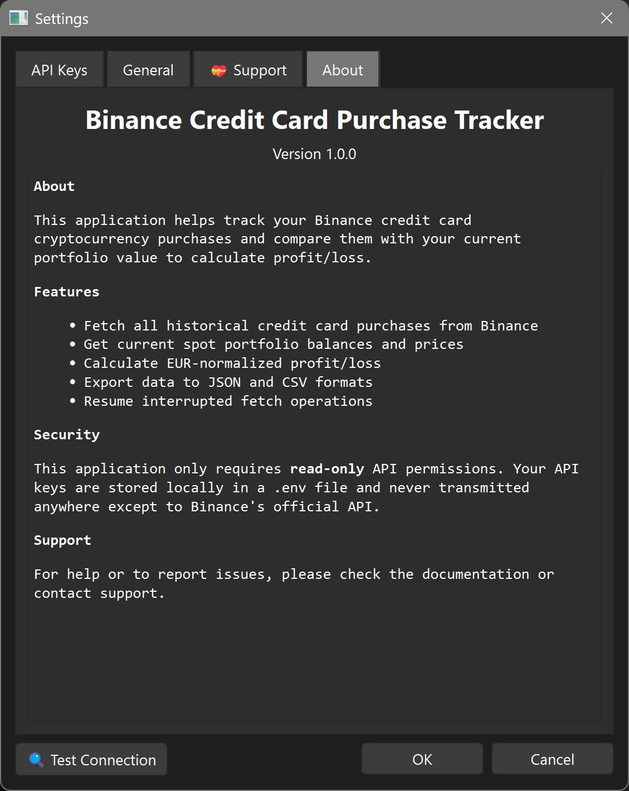

# 📈 Binance Full Deposit History Tool

[](https://www.python.org/downloads/)
[](LICENSE)
[](#system-requirements)

A comprehensive desktop application to track your Binance credit card cryptocurrency purchases, visualize your investment timeline, and calculate real-time profit/loss against your current portfolio.

---

## 🚀 **QUICK START FOR BEGINNERS** 

**Want to try the app in 5 minutes? Follow these simple steps:**

### Step 1: Download Python
- Go to [python.org/downloads](https://www.python.org/downloads/) 
- Download Python 3.8 or newer
- **Windows users**: Check "Add Python to PATH" during installation
- **Mac/Linux users**: Python might already be installed

### Step 2: Get the Code
```bash
# Download this project
git clone https://github.com/TonciZ/binance-fiat-deposit-history.git
cd binance-fiat-deposit-history
```
*Don't have git? [Download ZIP](https://github.com/TonciZ/binance-fiat-deposit-history/archive/refs/heads/main.zip) and extract it*

### Step 3: Automatic Setup (Easiest)

**📁 Where to run:** Open Command Prompt or Terminal in the project folder

**Windows users:**
- Right-click in the `binance-fiat-deposit-history` folder
- Select "Open in Terminal" or "Open PowerShell window here"
- Or press `Win + R`, type `cmd`, press Enter, then `cd` to your project folder

**Mac/Linux users:**
- Open Terminal
- Navigate to the project folder: `cd /path/to/binance-fiat-deposit-history`

**🚀 Run the setup:**
```bash
# Run the setup script - it does everything for you!
python setup.py
```

*The setup script will check your Python version, install all dependencies, create folders, and set up your .env file automatically!*

### Step 4: Verify Installation (Optional but Recommended)
```bash
# Make sure everything works
python verify_installation.py
```

### Step 5: Get Your Binance API Keys
1. Go to [Binance API Settings](https://www.binance.com/en/my/settings/api-management)
2. Create a new API key
3. **IMPORTANT**: Only enable "Enable Reading" - nothing else!
4. Copy your API Key and Secret

### Step 6: Run the App

**Option A: Using Python command (All platforms)**
```bash
# Start the application
python main.py
```

**Option B: Using run.bat (Windows only - Even Easier!)**
- Double-click the `run.bat` file in the project folder
- The batch file will:
  - Check if Python is installed
  - Install missing dependencies automatically
  - Launch the application
  - Keep the window open if there are any errors

*The run.bat file is perfect for Windows users who want a one-click solution!*

### Step 7: Configure & Use
1. Enter your API keys in the settings dialog that appears
2. Click "Test Connection" to verify
3. Click "Fetch Card Purchases" to import your data
4. Explore your crypto investment history!

**That's it! 🎉**

---

## 📸 Screenshots

### Main Dashboard with Interactive Charts


### Interactive Chart Hover Details


### Settings & Configuration



### About & Information


## ✨ Features

- 📥 **Historical Data Import**: Fetch all credit card crypto purchases from Binance
- 💰 **Live Portfolio Tracking**: Get current spot balances and real-time prices
- 📊 **Interactive Charts**: Visual timeline with buy/sell bars and P/L analysis
- 🧮 **Multi-Currency Support**: EUR/HRK conversion with configurable rates
- 📁 **Data Export**: JSON and CSV exports for external analysis
- ⚡ **Resume Capability**: Interrupted operations can be resumed from checkpoints
- 🔒 **Security First**: Read-only API permissions, local storage only
- 🎨 **Modern UI**: Clean desktop interface with responsive design

## 🚀 Quick Start

### Prerequisites

- **Python 3.8 or higher** ([Download here](https://www.python.org/downloads/))
- **Binance account** with API access
- **Internet connection** for API calls

### 1. Clone & Install

```bash
# Clone the repository
git clone https://github.com/TonciZ/binance-fiat-deposit-history.git
cd binance-fiat-deposit-history

# Create virtual environment (recommended)
python -m venv venv

# Activate virtual environment
# On Windows:
venv\Scripts\activate
# On macOS/Linux:
source venv/bin/activate

# Install dependencies
pip install -r requirements.txt
```

### 2. Set Up Binance API

1. Visit [Binance API Management](https://www.binance.com/en/my/settings/api-management)
2. Create a new API key with **ONLY** these permissions:
   - ✅ **Enable Reading** - Required for fetching data
   - ❌ **Enable Trading** - NOT required (keep disabled for security)
   - ❌ **Enable Withdrawals** - NOT required (keep disabled for security)
3. Copy your API Key and Secret Key

### 3. Launch Application

```bash
python main.py
```

On first run, you'll be prompted to enter your API credentials via a settings dialog.

### 4. Start Tracking

1. **Test Connection**: Click "🔍 Test Connection" to verify API setup
2. **Fetch Purchases**: Click "📥 Fetch Card Purchases" to import historical data
3. **Update Portfolio**: Click "💰 Get Current Portfolio" for latest balances
4. **View Results**: Explore charts, tables, and export options

## 🖥️ System Requirements

| Platform | Minimum | Recommended |
|----------|---------|-------------|
| **Windows** | Windows 10+ | Windows 11 |
| **macOS** | macOS 10.15+ | macOS 12+ |
| **Linux** | Ubuntu 20.04+ | Ubuntu 22.04+ |
| **Python** | 3.8+ | 3.11+ |
| **RAM** | 2GB | 4GB+ |
| **Storage** | 100MB | 500MB+ |

## 📦 Installation Options

### Option A: Python Installation (Recommended)

```bash
# Method 1: Direct installation
pip install -r requirements.txt
python main.py

# Method 2: Virtual environment (safest)
python -m venv binance-tracker-env
source binance-tracker-env/bin/activate  # Linux/macOS
# or
binance-tracker-env\Scripts\activate     # Windows
pip install -r requirements.txt
python main.py
```

### Option B: Standalone Executable

```bash
# Build standalone executable
pip install pyinstaller
pyinstaller --onefile --windowed --name="Binance-Full-Deposit-History-Tool" main.py

# Executable will be in dist/ folder
./dist/Binance-Full-Deposit-History-Tool  # Linux/macOS
./dist/Binance-Full-Deposit-History-Tool.exe  # Windows
```

## ⚙️ Configuration

### Environment Variables

Create a `.env` file in the project root:

```env
# Required: Binance API Credentials
BINANCE_API_KEY=your_api_key_here
BINANCE_API_SECRET=your_secret_key_here

# Optional: Application Settings
SLEEP_BETWEEN_CALLS=1.0        # API rate limiting (seconds)
START_YEAR=2016                 # Historical data start year
HRK_TO_EUR_RATE=7.5            # Croatian Kuna to Euro conversion
API_TIMEOUT=30                  # Request timeout (seconds)

# Optional: Donation Addresses (for contributors)
DONATION_BTC_ADDRESS=
DONATION_ETH_ADDRESS=
DONATION_URL=
```

### GUI Configuration

All settings can also be configured through the application's Settings dialog:
- **File → Settings** or **Ctrl+,**
- Test API connection before saving
- Automatic configuration validation

## Usage

### First-Time Setup

1. **Launch the application**: Run `python main.py`
2. **Configure API keys**: Enter your Binance API credentials in the settings dialog
3. **Test connection**: Click "Test Connection" to verify your API setup

### Fetching Data

1. **Fetch Purchases**: Click "📥 Fetch Card Purchases" to download all your historical credit card crypto purchases
   - This will fetch data in quarterly chunks from your start year to present
   - The operation is resumable if interrupted
   - Progress is saved in checkpoints and incremental backups

2. **Update Portfolio**: Click "💰 Get Current Portfolio" to get your latest spot balances and current prices

3. **View Results**: The summary tiles show:
   - Total EUR spent on purchases
   - Total fees paid
   - Current portfolio value in EUR
   - Net profit/loss with percentage

### Exporting Data

- **JSON Export**: Click "📁 Export JSON" for machine-readable format
- **CSV Export**: Click "📊 Export CSV" for spreadsheet analysis
- Files are saved to the `exports/` directory

### Understanding the Data

- **Purchases Tab**: Shows all credit card purchases with dates, amounts, and fees
- **Spot Balances Tab**: Current cryptocurrency holdings
- **Price Map Tab**: Current EUR prices for all assets
- **Interactive Chart**: Investment timeline with buy/sell bars and P/L visualization

## Currency Support

- **EUR**: Primary currency for calculations
- **HRK**: Converted to EUR using configurable fixed rate (default: 7.5)
- **Other currencies**: Currently assume EUR (can be extended)

## Security Features

- ✅ **Read-only API permissions** - No trading or withdrawal capabilities
- ✅ **Local storage only** - API keys stored in local `.env` file
- ✅ **No telemetry** - No data sent anywhere except Binance's official API
- ✅ **Open source** - Full source code available for review

## File Structure

```
binance-tracker/
├── Design.md              # System design document
├── README.md              # This file
├── requirements.txt       # Python dependencies
├── main.py               # Application entry point
├── run.bat               # Windows one-click launcher
├── setup.py              # Automatic setup script
├── verify_installation.py # Installation verification
├── test_core.py          # Core functionality tests
├── .env.example          # Environment template
├── images/               # Screenshot images
├── api/                  # Binance API client
│   ├── binance_client.py # HTTP client with authentication
│   └── fiat.py           # Fiat orders fetching logic
├── core/                 # Core business logic
│   ├── config.py         # Configuration management
│   ├── currency.py       # Currency conversion utilities
│   └── cache.py          # SQLite database management
├── ui/                   # User interface
│   ├── main_window.py    # Main application window
│   └── settings_dialog.py # Settings configuration dialog
├── data/                 # JSON data storage
│   ├── purchases.json    # Transaction history
│   ├── balances.json     # Portfolio balances
│   └── prices.json       # Current prices
└── exports/              # Export files and backups
    ├── purchases.json    # All purchases export
    ├── purchases.csv     # CSV format export
    └── *.json            # Incremental backups
```

## API Rate Limiting

The application respects Binance API rate limits:
- Configurable sleep between requests (default: 1 second)
- Automatic retries with exponential backoff
- Stops on authentication errors
- Resume capability for long operations

## 🛍️ Troubleshooting

### Installation Issues

**"Python version not supported"**
- Download Python 3.8+ from [python.org](https://www.python.org/downloads/)
- Verify installation: `python --version`

**"pip install failed"**
```bash
# Try upgrading pip first
python -m pip install --upgrade pip

# Then install requirements
pip install -r requirements.txt

# On macOS/Linux, you might need:
python3 -m pip install -r requirements.txt
```

**"Module not found" errors**
- Ensure you're in the correct directory
- Activate virtual environment if using one
- Run: `python setup.py` for automatic setup

### API Issues

**"API connection failed"**
- Verify your API Key and Secret are correct
- Ensure you have "Enable Reading" permission enabled
- Check your internet connection
- Try the "Test Connection" button in settings

**"Authentication failed"**
- Your API key may be incorrect or expired
- Regenerate API keys on Binance and update in settings
- Ensure no extra spaces in key/secret

**"Rate limit exceeded"**
- Increase the sleep time in settings (default: 1 second)
- Wait a few minutes and try again
- Check if other applications are using Binance API

### Data Issues

**Missing purchases**
- Check the start year in settings
- Some older purchases might not be available via API
- Ensure you're looking at credit card purchases (not spot trades)

**Chart not loading**
- Ensure PyQtGraph is installed: `pip install pyqtgraph`
- Check if you have transaction data
- Try refreshing portfolio data

### Platform-Specific Issues

**Windows: "Access denied" or "Permission error"**
- Run command prompt as administrator
- Try installing in a virtual environment

**macOS: "Command not found"**
- Use `python3` instead of `python`
- Install via Homebrew: `brew install python`

**Linux: Missing GUI libraries**
```bash
# Ubuntu/Debian
sudo apt-get install python3-tk python3-dev

# CentOS/RHEL
sudo yum install python3-tkinter python3-devel
```

## Building Standalone Executable

To create a standalone executable with PyInstaller:

```bash
pip install pyinstaller
pyinstaller --onefile --windowed --name="Binance-Full-Deposit-History-Tool" main.py
```

The executable will be in the `dist/` folder and can be shared without Python installation.

## 🔧 Utility Scripts

The project includes several helper scripts to make installation and testing easier:

### `setup.py` - Automatic Setup Script

**What it does:**
- Checks if your Python version is compatible (3.8+)
- Automatically installs all required dependencies
- Creates necessary directories (`data/`, `exports/`, `logs/`)
- Sets up your `.env` file from the template
- Handles common setup issues automatically

**How to use it:**
```bash
# Run this first after downloading the project
python setup.py
```

**When to use it:**
- First time setting up the project
- After updating Python or dependencies
- When you get "module not found" errors
- If manual installation steps aren't working

---

### `verify_installation.py` - Installation Checker

**What it does:**
- Verifies your Python version is compatible
- Checks if all required Python packages are installed
- Tests if project files and folders are in place
- Attempts to import all application modules
- Tests basic GUI functionality
- Provides detailed error messages if something is wrong

**How to use it:**
```bash
# Run this to check if everything is set up correctly
python verify_installation.py
```

**Sample output:**
```
🔍 Binance Full Deposit History Tool - Installation Verification
============================================================
🐍 Testing Python version...
   ✅ Python 3.11.5 - Compatible

📦 Testing dependencies...
   ✅ httpx          - HTTP client for API requests
   ✅ PySide6        - Qt GUI framework
   ✅ pydantic       - Data validation
   ✅ dotenv         - Environment file handling
   ✅ tenacity       - Retry logic for API calls
   ✅ dateutil       - Date parsing utilities
   ✅ pyqtgraph     - Chart and graph widgets
   ✅ numpy          - Numerical computations for charts

📁 Testing project structure...
   ✅ main.py
   ✅ requirements.txt
   ✅ README.md
   ✅ api/
   ✅ core/
   ✅ ui/
   ✅ data/
   ✅ exports/

🔧 Testing application modules...
   ✅ core.config               - Configuration management
   ✅ api.binance_client        - Binance API client
   ✅ ui.main_window            - Main window

🖥️ Testing GUI functionality...
   ✅ QApplication creation - OK
   ✅ Chart widget import - OK

============================================================
📋 Verification Summary
============================================================
Python Version       - ✅ PASSED
Dependencies         - ✅ PASSED
Project Structure    - ✅ PASSED
Application Modules  - ✅ PASSED
GUI Functionality    - ✅ PASSED

============================================================
🎉 All tests PASSED! Installation is working correctly.

You can now run the application with:
   python main.py
============================================================
```

**When to use it:**
- After running `setup.py` to verify everything worked
- Before reporting bugs or asking for help
- After updating dependencies or Python
- When the main application won't start
- To generate diagnostic information for troubleshooting

---

### `test_core.py` - Core Functionality Tests

**What it does:**
- Tests that core application modules can be imported
- Verifies currency conversion functions work correctly
- Tests chart widget creation
- Tests data storage and retrieval functionality
- Runs unit tests on business logic functions
- Provides detailed test results and error information

**How to use it:**
```bash
# Run this to test core functionality
python test_core.py
```

**Sample output:**
```
🚀 Binance Full Deposit History Tool - Core Functionality Tests
============================================================

📋 Import Tests
----------------------------------------
🧪 Testing imports...
  ✅ core.config
  ✅ core.currency
  ✅ core.json_data_manager
  ✅ api.binance_client
  ✅ ui.chart_widget
✅ Import Tests PASSED

📋 Chart Widget Creation
----------------------------------------
🧪 Testing chart widget creation...
  ✅ Chart widget created successfully
✅ Chart Widget Creation PASSED

📋 Currency Functions
----------------------------------------
🧪 Testing currency functions...
  ✅ Price map building works
  ✅ Portfolio calculation works: 8000.00 EUR
✅ Currency Functions PASSED

📋 Data Manager
----------------------------------------
🧪 Testing JSON data manager...
  ✅ Purchase saving works
  ✅ Purchase loading works
✅ Data Manager PASSED

============================================================
📊 Test Summary
============================================================
✅ Passed: 4
❌ Failed: 0
📈 Success Rate: 100.0%

🎉 All tests passed! Core functionality is working correctly.
```

**When to use it:**
- After making changes to core application code
- When debugging application issues
- Before submitting bug reports
- To verify the application works after updates
- During development to ensure changes don't break existing functionality

---

### 🆘 **Troubleshooting with Utility Scripts**

**If the main application won't start:**
1. Run `python verify_installation.py` first
2. If verification fails, run `python setup.py`
3. Run verification again to confirm the fix

**If you're getting weird errors:**
1. Run `python test_core.py` to isolate the problem
2. Check the detailed error messages
3. Fix any missing dependencies or configuration issues

**If you need to report a bug:**
1. Run both `verify_installation.py` and `test_core.py`
2. Include the output from both scripts in your bug report
3. This helps developers understand your environment

## Development

### Project Structure
- `api/`: Binance API integration
- `core/`: Business logic and data management  
- `ui/`: PySide6 GUI components
- `main.py`: Application bootstrap

### Key Technologies
- **Python 3.11**: Main language
- **PySide6**: Qt-based GUI framework
- **PyQtGraph**: Charts and graphs
- **httpx**: HTTP client for API calls
- **JSON**: Simple local file storage
- **Pydantic**: Data validation

## Roadmap

- **v1.0**: ✅ Core purchase tracking and portfolio comparison
- **v1.1**: Dark mode, OS keyring for secure credential storage
- **v1.2**: Optional P2P and Pay transaction import
- **v2.0**: Historical portfolio valuations with "as-of" dates

## Support

For help, bug reports, or feature requests, please refer to the project documentation or contact support.

## License

This project is open source. See LICENSE file for details.

---

**⚠️ Disclaimer**: This tool is for informational purposes only. Always verify calculations independently. Not financial advice.
